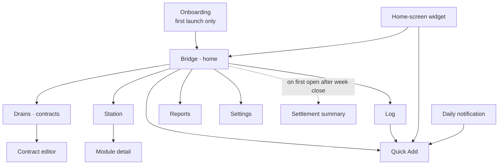

# 03 — Screens, States and Surfaces

Every screen below lists: purpose, contents, the states it must handle (including empty and error),
its primary action, and the stable `testTag` prefix used by UI and screenshot tests
([06](06-test-strategy.md)). Test tags are part of the spec, not an afterthought — they are declared
as constants in `:core:designsystem` so tests never match on user-visible text (which is localized).

## Navigation

Bottom navigation has four destinations — **Bridge, Log, Station, Drains**. Reports and Settings are
reached from the Bridge's top bar. Quick Add is a full-screen route, opened by the FAB from anywhere,
by the widget, and by the notification action.

---

## 1. Bridge (home) · `tag: bridge`

The home screen, and the only screen the user is guaranteed to see every day.

**Contents, top to bottom**

1. **Station viewport** — the cross-section of ORBIT-7, lit according to unlocked modules. Tapping it
   goes to Station. This is the emotional payload of the app and gets the most design attention.
2. **Power readout** — current EP balance in split-flap digits, plus EP earned this week so far
   (provisional — it is not banked until settlement, and must be labelled as such).
3. **Week gauge** — remaining budget for the current week as a horizontal reactor-headroom bar, with
   the day-of-week marker. Green above the line, amber approaching, alert when overdrawn.
4. **Today card** — today's total, the last 2–3 entries, and the one-tap **"Nothing spent today"**
   zero-spend mark (the confidence-factor affordance from
   [02 §3.3](02-game-design.md#33-the-confidence-factor-why-abandoning-the-app-doesnt-pay)).
   Once marked, it flips to a confirmed state and can be undone.
5. **Streak chip** — current streak multiplier.
6. **Next deadline** — the nearest contract cancellation deadline, if any is within 30 days.

**States**: first-run (no data — station fully dark, copy explains the loop), normal, overdrawn week,
zero-spend day marked, settlement pending (banner → summary).

**Primary action**: FAB → Quick Add.

## 2. Quick Add · `tag: quickadd`

The most-used screen. Target: **three taps** from FAB to saved — amount, category, save.

**Contents**: large amount readout at top; custom numpad (no system keyboard — it is faster, and the
CRT numpad is a design showpiece); horizontally scrolling category chips ordered by the user's own
recency and frequency; date defaulting to today with a discreet date stepper; optional note field
collapsed by default.

**Details that matter**: Save is always reachable with one thumb; after saving, the screen closes
with a confirmation toast offering **Undo**; a second entry can be started immediately from the
toast. Amount input rejects nothing but formats live (`12` → `CHF 12.00`, `1250` → `CHF 12.50` with
the "Rappen-first" input mode, which is a setting).

**States**: empty, amount entered, editing an existing expense (title and Save label change),
validation (amount zero → Save disabled, with the reason shown).

## 3. Log · `tag: log`

**Contents**: expenses grouped by day, newest first, each day with its total; sticky month header with
the month total; filter row (category, date range, amount range); swipe an entry to delete, with
Undo; tap to edit (→ Quick Add in edit mode).

**States**: empty (first run), filtered-empty (distinct copy and a clear-filters action), loaded,
paginating.

## 4. Budgets · `tag: budgets`

Reached from Reports and from Settings; also the second onboarding step.

**Contents**: one row per category — monthly budget, spend so far this month, the **baseline ghost
marker**, and a mini sparkline of the last 12 weeks. A month/week toggle switches all figures between
the monthly budget and its weekly proration. Tapping a row opens an editor sheet.

**Baseline suggestion** appears inline as a dismissible card on eligible categories
([02 §4.3](02-game-design.md#43-the-rolling-baseline)): *"Baseline CHF 180/week. Target CHF 162?"*
with Accept / Adjust / Dismiss.

**States**: pre-baseline (fewer than 28 days of data — the ghost marker is absent and the reason is
stated), with suggestion, edited-unsaved, archived categories hidden behind a toggle.

## 5. Station · `tag: station`

**Contents**: the station graphic at the top (shared element transition from the Bridge viewport), EP
balance, and a grid of modules below — each with its icon, current level, next-level cost and an
affordability state. Locked modules show their prerequisite. Tapping a module opens a detail sheet
with its description, what the next level does, the cost, and **Power up**.

**States**: nothing affordable (the nearest goal is highlighted with "X EP to go"), something
affordable, purchase in progress (the energy-transfer animation), fully upgraded.

**Primary action**: Power up a module — the app's second payoff moment, and the second-heaviest piece
of motion design.

## 6. Drains — contracts · `tag: drains`

**Contents**: a header stating total monthly fixed cost and its EP equivalent ("Your grid loses
214 EP/month to 7 drains"), then the contract list sorted by monthly bleed descending. Each row:
name, monthly equivalent, next charge date, and a countdown to the last possible cancellation date.
Rows inside 14 days of that deadline carry hazard striping. Cancelled and renegotiated contracts move
to a collapsed "Salvaged" section that keeps a running total of monthly savings achieved.

**Actions per contract**: Edit, **Cancel** (→ confirm → salvage payout animation), **Renegotiate**
(→ enter the new amount → salvage on the delta).

**States**: empty (with an explicit prompt to add the obvious suspects — phone, streaming, gym,
insurance), active list, deadline-urgent, salvaged section.

## 7. Contract editor · `tag: contract_editor`

Name, category, amount, cadence, next charge date, notice period (with CH-typical presets: 1 month,
3 months, none), and a derived, editable earliest-cancellation date. The derived date is always shown
with its calculation spelled out, so a wrong renewal date is obvious before it costs money.

## 8. Reports · `tag: reports`

Gated behind the Observation Deck module — an intentional reward for progressing.

**Contents**: settlement history (one row per week: EP awarded, confidence, streak, under/over),
per-category trend charts with the baseline ghost, lifetime EP, current streak and best streak, and
the **success-criteria panel** from [01](01-concept.md#success-criteria): contracts salvaged, monthly
fixed cost then vs. now, and baseline movement per category.

**States**: locked (explains how to unlock), insufficient history, loaded.

## 9. Settings · `tag: settings`

Language (de-CH / English / system), currency, week start day, Rappen-first input toggle, daily
reminder on/off and time, **reduce effects** toggle, contract deadline reminders on/off, JSON export,
JSON import (with an explicit "this replaces all data" confirmation), wipe all data (double
confirmation), and an About section stating that the app has no network permission.

## 10. Onboarding · `tag: onboarding`

Three steps, skippable at any point with sensible defaults applied:

1. **The pitch** — one screen, the core loop in three sentences, over a dark station.
2. **Categories** — a Swiss default set preselected (Groceries, Eating out, Transport, Household,
   Health, Leisure, Subscriptions, Other), each with a suggested starting budget the user can edit.
3. **Reminder** — pick an evening time, or decline.

On completion the station boots up (the CRT boot sequence) and the Bridge appears with one module
already lit, so the screen is never empty on first run.

## 11. Settlement summary · `tag: settlement_summary`

A full-screen takeover shown once, on first open after a week has been settled. Power generated,
multipliers as they applied, best and worst category, streak state, and — when applicable — "Reactor
Core L2 is now affordable" with a direct route to Station. Dismissible; re-readable from Reports.

---

## Android surfaces

### Home-screen widget · `tag: widget`

Glance widget, two sizes:

- **Small (2×2)**: power ring with EP balance in the middle.
- **Medium (4×2)**: power ring, remaining weekly budget bar, today's total, and a quick-add tap target.

Updates on data change and at most every 30 minutes otherwise. It renders in the same cassette-futurist
palette but with all motion removed — widgets do not animate, and pretending otherwise wastes battery.

### Daily reminder notification

One per day, at the user's chosen time, only if the app was not already used that day.

- **Title/body**: remaining budget for the week and today's total.
- **Action 1: Quick add** → opens Quick Add directly.
- **Action 2: Nothing spent today** → writes the zero-spend mark without opening the app.

That second action is what keeps the pure-trust model honest: the cheapest possible way to produce a
signal day is a single tap on a notification.

### Contract deadline notifications

At 30 / 14 / 3 days before a contract's last possible cancellation date. Tapping opens the contract.
These are the only notifications that may exceed one per day, because they are real-world deadlines
with money attached.

---

Previous: [02 — Game design](02-game-design.md) · Next: [04 — Design system](04-design-system.md)
